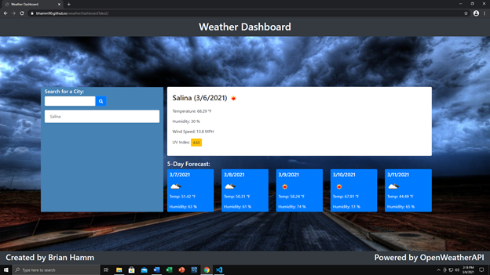
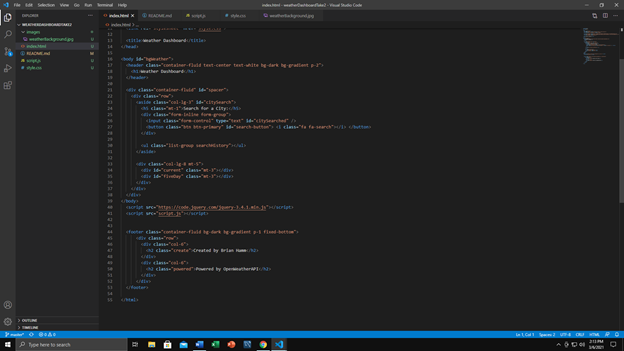
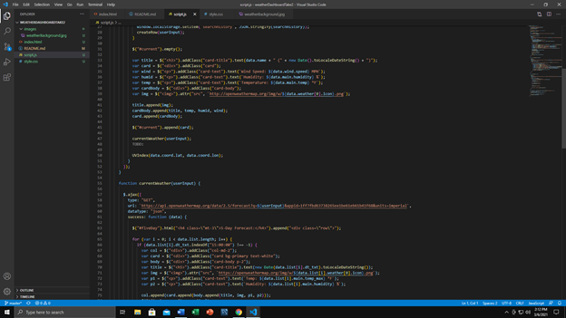
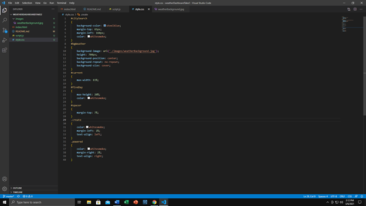

<header>
    <h1>Weather Dashboard</h1>
</header>

<body>

<h2>Purpose:</h2>
    

 The purpose of this activity was to build an fully functional weather dashboard. The weather dashboard must be connect to the OpenWeather API to grab current weather info and the five day forecast. The user should be able to type in any city in the search box provide and be given the report for that area. aa

<h2>Task List:</h2>

<ol>
    <li> Deploy a Functional Webpage </li>
    <li> Provide the user with the ability to search for a city and be provided the current weather</li>
    <li> On the back end link the webpage with the API to provide current info for all the fields</li>
    <li> Provide the user the ability to click on past citys searched using their local storage</li>
    <li> Provide colored UV index to provide whether the condition were favorable or not</li>
    <li> Provide clean and fuctional code</li>
</ol>

<h2>Website Deployment</h2>

 The current version of this website can be found here. <a href="https://bhamm90.github.io/dayPlanner/">(Day Planner)</a>

<h2>Feedback</h2>

 Please get ahold of me with any suggestions for features/items you believe should be added. Also feel free to let me know of any issues you may come across while using the page. You can reach me on <a href="https://stackoverflow.com/users/14324130/bhamm90">Stack Overflow</a> with any comments and concerns. For any issues and fixes you can file an issue at the <a href="https://github.com/BHamm90/dayPlanner/issues">Day Planner link </a> <-- so I can fix them as soon as possible. 

<h3>Website Preview:</h3>

<h3>Preview of the HTML: <h3>

<h3>Preview of the Javascript</h3>

<h3>Preview of the CSS</h3>

<h4>Looking Forward: </h4>

 Looking forward I would like to continue updating this weather dashboard. I would like to update the icon used by OpenWeatherAPI. Maybe do a 7 day forecast so the user has the whole week. Also, I would like to provide radar or active weather map. Lastly as always any suggestions to make your user experience better are always welcome so please feel free to let me know.

<Footer>
 
 © 2020 Trilogy Education Services, a 2U, Inc. brand. All Rights Reserved. 

</Footer>
